```mermaid
flowchart LR
A("အိပ်မက် က လန့်နိုးတိုင်းအမြဲ </br> လက်ရှိ ဘဝကို မုန်းတီးနေတုန်းပဲ </br> ရုန်းထွက်ဖို့ မတတ်စွမ်းသာ </br> ရှင်ရတဲ့ လူ့ဘဝ ဒုက္ခတွေကြားမှာ")--> A2("ငါ့ဘဝကို ယူသွားပါ </br> ဒုက္ခတွေ ချုပ်ငြိမ်းရာ </br> အမှားမကင်းနိုင်တဲ့ သံသရာထဲက") --> A3("လမ်းမတွေ့ တဲ့ အမှောင်ထဲတိုး </br> စမ်းတဝါး နဲ့ မနေချင်လို့ </br> မတပ်မက် တော့ဘူး မရချင်ဘူး </br> ငါ့ဘဝကို ပြန်ယူ")
```

# [Aung Myo Kyaw](https://www.aungmyokyaw.com)

> i write code

> 💻 🧘‍♂️ 📝 📚 📖 🖋️ 🎸 🌼

> [](https://www.linkedin.com/in/aungmyokyaw/)

> ပညာ သမာ၊ အာဘာ နတ္ထိ

> I am the greatest

> I said that even before I knew I was

> 😍 love this song https://youtu.be/TEwJvCZBX3Q 😍

---

[](https://github.com/AungMyoKyaw)

[](https://github.com/AungMyoKyaw)

[](https://github.com/AungMyoKyaw)

---



[](https://youtu.be/TEwJvCZBX3Q)

---

[](https://youtu.be/7dcNG6-5O2o)

```txt
A single step becomes a leap of faith
That's when you realize you started flying
So don't you ever say you're giving up ?
No, there's no looking back

'Cause we were all meant to fly
Spread your wings across the universe
It's your time to
It's your time to shine
There's a light inside of all of us
Soon you'll find that
It's your time to fly
It's your time to fly
```

---

> the finish line doesn't have an expiration date
